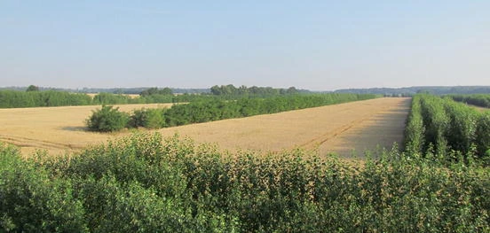
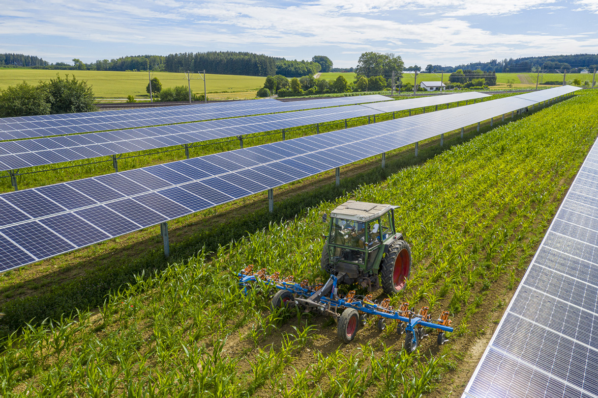
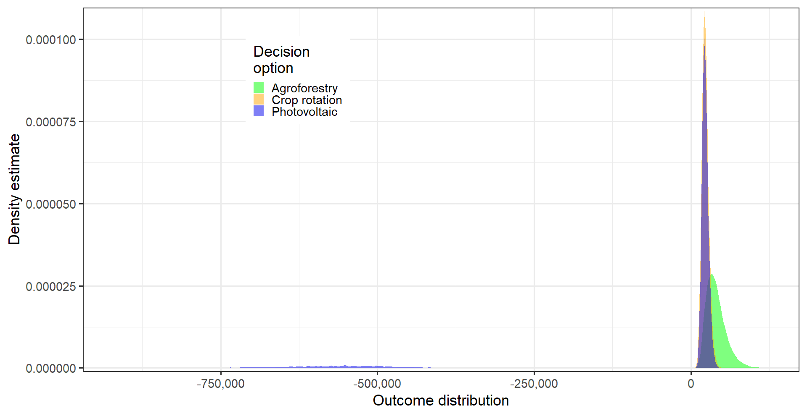
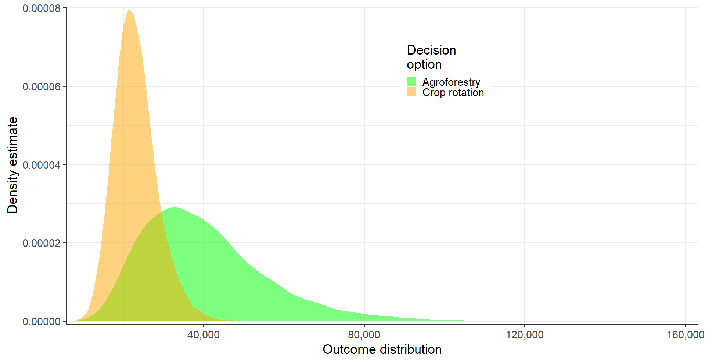
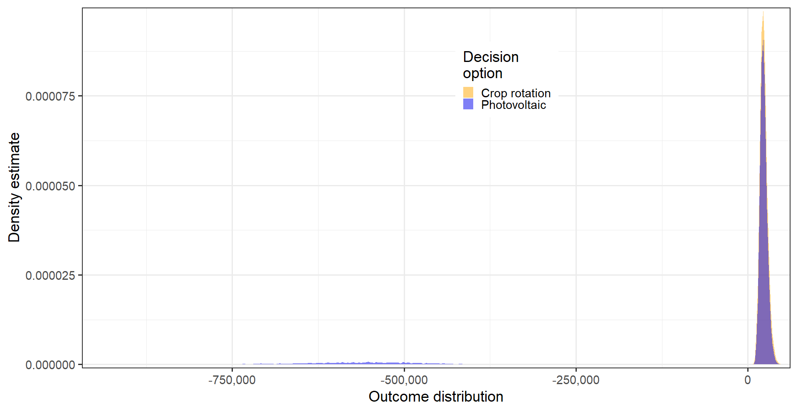
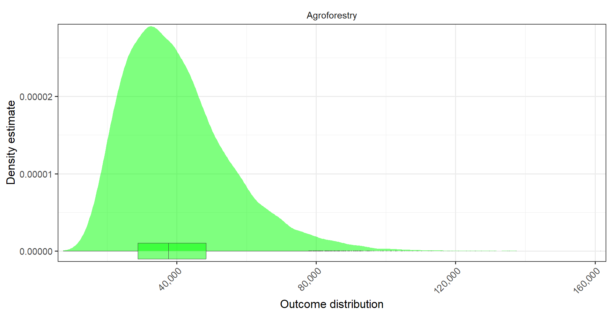
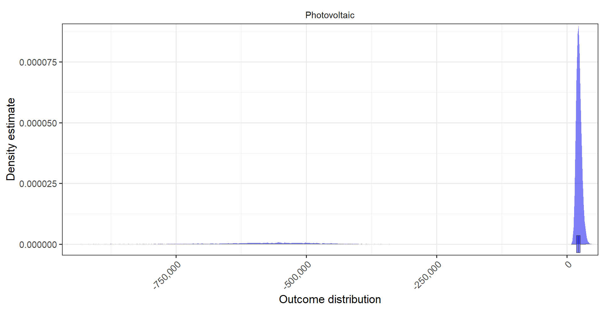
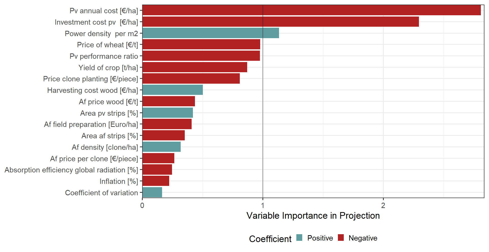
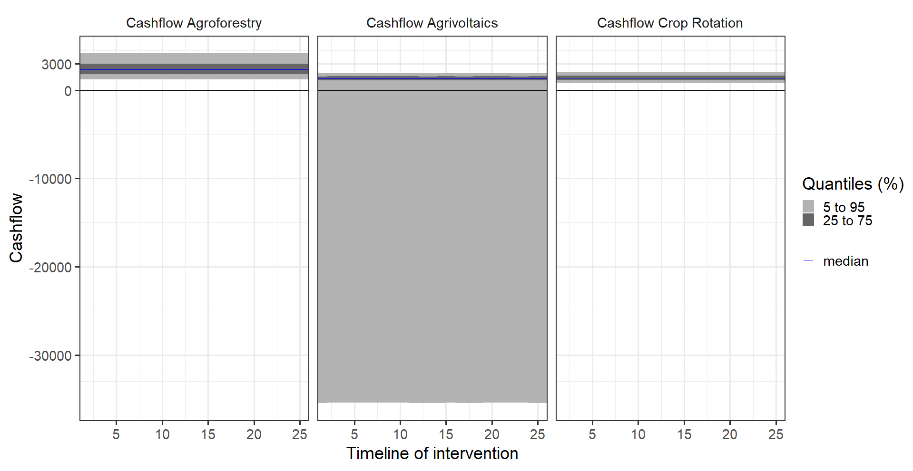

---

<style>
body {
text-align: justify}
</style>


```{r setup, include=FALSE}
knitr::opts_chunk$set(echo = TRUE)
```

**Decision Analysis and Forecasting for Agricultural Development**
*Group Project by Julia, Jonas, Nick, Robin, Simon*

# 01 Introduction 

> In 2022, 20.4 % of german final energy consumption was covered by renewable energy (RE). Considering the production of electricity from renewables, the renewable heat sector and the production of biogenic fuels, biomass is the most important source of renewable energy, covering 52 % of final energy. Solar energy provides 14 % of total RE for the aforementioned sectors, focusing on electricity and heat.  The production of solar energy has increased by 57 % over a five year period (2017 – 2022), while the production of energy through biomass stayed rather constant, increasing only about 1 %. The relative importance of biomass as a source of RE on the other hand increased. The reason being the decrease in energy production using nuclear power plants and fossil fuels,  which makes the “on demand” energy production, that biomass ensures all the more important in case neither wind turbines nor photovoltaics deliver enough energy to meet demands (Lewicki, 2013). On EU-level, biomass continues to be the main source of renewable energy (about 60 % of total RE). Although most biomass for energy is produced within the EU, 4 % are currently being imported (European Commission Joint Research Centre., 2019). Biomass as well as photovoltaics will likely continue to play a major role in Germany's shift to a carbon neutral energy production. 
One way to expand the production of RE without the destruction of (semi-) natural ecosystems such as forests, peat bogs and high diversity pastures would be to include the production of energy into an intensive arable farming operation. Systems combining arable farming and the production of solar energy are called agrophotovoltaic systems (Weselk et al., 2019), while the production of wood as a RE source within an arable field is one of many approaches, which fall under the umbrella term “agroforestry” (ICRAF, 2017).
While both methods aim to maximize land use efficiency and promote sustainability, they have distinct characteristics and offer different benefits, which will be discussed in the following study.

## 01.1 System specificities – Agriphotovoltaics (Agri-PV)

> Agri-PV can certainly become an important building block for an increased sustainable energy production. “Many farmers see Agri-PV as a good way to combine renewable energies with agriculture" , says the Deputy Secretary General of DBV (Deutsche Bauernverband) (DBV, 2022).  Photovoltaic covered 11 % of gross electricity consumption in Germany. Prices for solar panels decreased by 75 % since 2006 (Frauenhofer ISE, 2023). Integrated panels generate electricity, which the decision maker could sell for a market price of 5.8 ct/kWh (Frauenhofer ISE, 2023) in our model approach. Agri-PV provides opportunities for farms to diversify their income, leading also to more evenly distributed effects of risk events.
This can significantly increase the productivity and value of agricultural land in warm and dry years (Trommsdorff et al., 2021). By utilizing existing scaffolding structures, additional protection systems can also be integrated in a cost-effective manner, which plays an especially important role in the production of high value horticultural crops like fruits.
However, there are challenges to agricultural production when using Agri-PV.

> These include, above all, the changing light conditions and the more difficult operation of machines between the rows of solar panels and crops.
To minimize risks and make the best use of synergy effects, suitable crops should therefore be combined with the appropriate system design. The above arguments are quite difficult to title with values, as they can be both advantages and disadvantages. 
Agri-PV systems can be categorized into high-mounted and ground-mounted systems. In this study we assumed the latter (ground-mounted \< 2.1 m) .
The advantages of ground-based systems are primarily their lower cost and low visual impact on the landscape. Support with Common Agricultural Policy (GAP) funds continues to be possible, provided that agricultural use is only impaired by up to 15 % of the total field area. In our decision model the value of area photovoltaic strips is set to 10 - 30 % for better comparison with the Agroforestry system (see below).  We decided to assume the installation of a 1000 kWp per hectare system within the following model.  For simplification, we decided to work on the principle of complete selling of the generated electricity with a constant price of 0.058 €/kWh.

## 01.2 System specificities – Agroforestry system (AFS)

> Agroforestry describes the purposeful integration of trees and shrubs (woody perennials) within a farming operation. Agroforestry for energy production combines two distinct production systems within the same farm-scape, namely arable crop production (or pasture based livestock keeping) with a short rotation coppice plantation (SRCP). SRCP consist of fast growing pioneer trees, in germany mainly willows (Salix spp.), poplars (Populus spp.) or black locust (Robinia pseudoacacia). These trees are planted, mainly as cuttings, at high densities of 10.000 - 15.000 trees per hectare, and regularly cut back (coppiced). After harvesting the wood the tree stumps are left to resprout and a new production cycle of 3-7 years begins. Wood from SRCP is usually regarded as low quality and is mainly used for energy production in biomass power plants or in private households as wood chips or pellets (Strohm et al., 2012). For this study, we assume one option for the farmer is an AFS that consists of arable cropping with alleys of poplars.
Integrating the idea of SRCP into an alley cropping agroforestry system, rather than planting a true monoculture of fast growing trees on a dedicated part of the farm provides the multiple benefits, commonly associated with AFS; The integration of woody perennials into arable cropping systems can reduce the negative ecological impacts of arable farming such as heavy soil erosion and landscape homogenisation, which is associated with a decrease in structural and biological diversity (Rundlöf & Smith, 2006; Jose, 2009). The absence of soil tillage within the tree rows and the build up of below ground biomass also leads, on farm scale, to a medium to long term increase in stored carbon (Jose, 2009). The ecosystem services provided by Agri-PV partially overlap with the services provided by the AFS, since the soil below the solar panels is usually not tilled, leading to permanent ground cover and with that a reduction of soil erosion. Oftentimes a mixture of native grasses and forbes is seeded below the panels, also increasing the ecological value of the overall system (Walston et al., 2022). Agri-PV always includes a necessary partial sealing of the soil to securely mount the solar panels and, due to the absence of deep rooting woody plants there is presumably less below ground carbon storage compared to AFS. 
While diversification of income streams is an effective risk management strategy in farming, the establishment of an AFS or an Agri-PVS seems desirable only if the system is at least as economically viable as the standard arable systems. That is why this study focuses on a comparison of the generated net present value (NPV) in each system, to identify which integrative approach of on-farm energy production is the most compatible.


# 02 The Decision


> In terms of energy production, should a commercial conventional arable farmer in North Rhine-Westphalia, Germany, rather establish an AFS system or an Agri-PV system on his land? <br>
Based on these guiding questions, two scenarios can be derived which we referred to in our
decision-support. For this study we chose to compare the Agri-PV system to an agroforestry system, consisting of arable crop land and tree strips of fast-growing poplar trees. 

> This type of AFS falls within the broad definition of silvoarable AFS or "alley cropping systems". The tree strips consist of multiple rows of trees, that are densely planted (10.000 – 15.000 trees/ha) forming a dense hedgerow-like structure, that is regularly coppiced. The width of the tree strips can range from 3-25 m and can legally occupy 2-35 % of the arable field to be registered as an agroforestry system and be eligible to funding (Böhm, 2022)(see Fig. 2).


```{r , fig.align = 'center', echo=FALSE, message=FALSE, warning=FALSE, paged.print=FALSE, fig.cap="Fig.2: Dirk Freese 2014; in Quinkenstein et al., 2017"}

```


>Agriphotovoltaic (Agri-PV) and agroforestry are two distinct approaches that integrate energy production with agricultural practices on farms. While both methods aim to maximize land use efficiency and promote sustainability, they have distinct characteristics and offer different benefits.
Agriphotovoltaic involves the combination of solar panels and agricultural activities on the same land. The panels are elevated to create a canopy that provides shade for crops while generating renewable energy. This approach maximizes the use of land by allowing dual-purpose utilization for electricity production and agricultural cultivation. Agri-PV systems offer advantages such as increased renewable energy generation, improved water efficiency, and potential financial benefits from selling surplus energy.
On the other hand, agroforestry is a land use system that integrates trees or shrubs with agricultural crops or livestock. It involves the deliberate planting of trees alongside or within agricultural fields. Agroforestry systems can take various forms, including alley cropping, silvopasture, or windbreaks. These systems offer several benefits, such as improved soil fertility, increased biodiversity, and enhanced climate resilience. The trees provide shade, wind protection, and nutrient cycling, which can positively impact crop yields and animal welfare.



>When comparing the two approaches for energy production on the farm, several factors come into play. Agriphotovoltaic systems excel in generating renewable energy and can provide a stable additional income stream for farmers. They require less time to establish compared to agroforestry systems and have a relatively low maintenance requirement. However, Agri-PV systems may have higher upfront costs associated with solar panel installation and require careful planning to optimize the arrangement of panels and crops.
Agroforestry, on the other hand, offers a range of ecological benefits beyond energy production. The integration of trees improves soil health, reduces erosion, and enhances carbon sequestration. Agroforestry systems contribute to biodiversity conservation by providing habitat for wildlife and supporting pollinators. They can also help mitigate the impacts of climate change by providing shade and wind protection to crops and livestock.
While both agriphotovoltaic and agroforestry have their distinct advantages, they are not mutually exclusive options. In fact, a synergistic approach that combines elements of both systems could be a viable solution. Integrating solar panels within agroforestry systems, for example, allows for simultaneous energy production, biodiversity enhancement, and improved microclimates for agricultural activities.
Ultimately, the choice between agriphotovoltaic and agroforestry for energy production on the farm depends on various factors such as the farm's specific needs, available resources, and long-term goals. Both approaches offer opportunities to enhance sustainability, increase resilience, and contribute to a more integrated and efficient use of land for energy and agricultural production.

>As part of the decision analysis and forecasting in agriculture module at the university of Bonn, we would like to take a closer look at the decision between the two systems for farmers. The following project is intended to facilitate the decision-making process for farmers and to help them make the best possible decision. 


```{r, echo=FALSE, message=FALSE, warning=FALSE}

# here we could start our first real code :) 

```

# 03 Decision Maker

> The head of an arable farming operation notice the current tense situation on the energy market and realize that they no longer only are responsible for food production, but also have the opportunity to contribute to the local energy security by supplying renewable energy with the land they farm. They are already familiar with the concepts of agroforestry and  agrophotovoltaics, and are convinced of the ecological benefits of dividing large fields to create 'ecotones' (the boarder of two seperate adjecent ecosystems) and structural elements to promote local biodiversity (see e.g.: JOSE, 2009). However, they will only consider setting up a new system if they can continue to farm at least as profitably as before. They wonder, which system would generate the highest net present value and how the two energy production systems compare to their standard arable operation.

```{r,echo=TRUE, message=FALSE, warning=FALSE, fig.cap="Fig. 4: Location"}
library(chillR)
library(leaflet)
library(dplyr)
library(reshape2)
library(kableExtra)
library(ggplot2)
library(Kendall)
leaflet() %>%
  setView(lng=6.99, lat=50.625, zoom=12) %>%
  addTiles() %>%
  addMarkers(lng=6.99, lat=50.625, popup='Campus Klein-Altendorf') %>%
  addScaleBar(
    position = c('bottomleft'),
    options = scaleBarOptions()
  )
# scaleBarOptions(
#   maxWidth = 100,
#   metric = TRUE,
#   imperial = TRUE,
#   updateWhenIdle = TRUE
# )
```

# 04 Stakeholder
> Changing farming operations means making changes to the biophysical functionality of the landscape, resulting also in a change in the way the landscape looks and how the farming system, embedded within the landscape interacts with its other components. These changes are not only of the farmers' concern. That is why there are usually a lot of stakeholders to consider, when planning agricultural interventions. Stakeholders would be businesses, directly profiting from a certain way of farming in the region. This includes for example agricultural contractors, who do the harvesting and chipping of the wood produced in the agroforestry systems. More such systems could lead to a better machine utilization and more profit. The same applies for contractors who do maintenance work on photovoltaic systems. In case of the agroforestry system, nearby biomass power plants can be considered stakeholders as well, which might profit from the local production of the needed raw material. Nature conservation agencies might appreciate the partial extensification in Agri-PV and agroforestry systems but might also consider threatened open landscape species such as certain birds. A reduction of energy imports can be of interest for the local government and lead to subsidies for the compared systems. Lastly, the acceptance of the local community regarding intense changes within the landscape must be considered when deciding on which intervention to carry out (Kang et al., 2021).

# 05 Conceptual Model

> The conceptual model of the decision consists of two main parts (see figure 4).
The first part includes the direct investment costs, the running costs and the profit of both decision options (see Fig. 5).
The actual conceptual model is illustrated in Fig. 5.
The cost of an agroforestry system is composed of the investment cost, the running cost, and the profit margin. Investment costs include mainly those for consultation as well as planning of the system, costs for wages and the transplants. Running costs are the recurring cost items of maintaining the agroforestry system. These are costs mainly in the first three years. This includes watering the cuttings and good weed management. In addition, we have included the risk of price fluctuation, which can occur either in the timber yield or in the timber price. In both cases, mainly the profit margin would be reduced. The only constant regarding the calculation of the profit margin is assumed to be the support from the CAP (Common Agricultural Policy). The other component of the model consists of the agri-PV system. So, similar to agroforestry, it is about the cost and the profit in terms of energy production. The profit is mainly derived from the Renewable Energy Sources Act (EEG) price and the amount of solar irradiation, which is influenced by the location. For the costs, a distinction was made between investment and running costs. Investment costs include photovoltaic modules, substructure, grid feed, inverter, price of installation and mounting. The running costs include the deposit insurance to operate an agri-PV system and the maintenance costs.<br>
These costs were expressed on a per hectare basis so that they could be scaled between the two main parts of the decision.


# 06 Input table
>The values of each variable are given as the lower and upper limit of a range covering the 90 % confidence interval of the distribution.
Thus, the lower estimate marks the 5 % quantile and the 95 % quantile limit.
The input values were determined by conducting literature research and expert interviews. <br>
Some problems became apparent when generating data for the Agri-PV system.
The system used here is still new and only at the research stage.
Therefore, investment costs are not yet considered so these costs were obtained from open space PV (Top Agrar, 2021). An advisor from the agricultural extension agency of North Rhine-Westphalia (Landwirtschaftskammer - LWK) informed us about the running costs with regard to the Agri-Pv systems. For the EEG price we have §48 (2) EEG 2023 up to and including 1,000 kWp with fixed feed-in tariff of 5.8 ct/kwh (Bayerische Landesanstalt für Landwirtschaft, 2023) 
<br>
The input estimates for the agroforestry system were derived from systems, which each represent one component of the alley cropping system assumed within this study. As the perennial component of the system can be regarded as strips of short rotation coppice plantations, estimates about inputs, costs and yields were derived from research about such plantations. The estimates for the arable component were derived mainly from yield evaluations from the LWK (see: Böcker, 2022) and similar studies (e.g.: Langenberg et al., 2018).


```{r, warning=FALSE, fig.cap="Fig. 6: Input Data as estimates"} 
library(kableExtra)
df <- read.csv2("Markdown/input_estimates_project_Sources.csv")
   kable(df) %>%    
   kable_styling("striped", position = "left", font_size = 10)  
```
  
> > The important variables from (Fig. 9) <br> "Pv annual costs"     [€/ha]: The annual running costs of the power installation <br>
"Investment costs pv" [€/ha]: The initial installation costs broken down over the time span of usage that is 26 years; divided by n_years = 26 <br>
"Power density"       [W/sqm]: The absorption solar radiation by the panels per square meter (sqm).  
  
# 07 Results 

## 07.1 MonteCarlo-Simulation

```{r , fig.align = 'center', echo=FALSE, message=FALSE, warning=FALSE, paged.print=FALSE, fig.cap="Fig.7: Comparision of differend NPVs"}

```

> Monte-Carlo simulation of for the three possible decisions Agroforestry, Photovoltaic or Crop Rotation (Fig. 7). The probabilities for possible revenue or loss are graphed with this density histograms for intuitive comparison, ultimately guiding the decision process with figures that are as scientific as possible. <br>The x-axis shows outcome distribution in €/ha over the time span n_years = 26. <br>
The y-axis shows the density estimation that shows the probability of the linked outcomes. <br>
The peak of the distributions for photovoltaic and for Crop Rotation 20,000€/ha and the peak of Agroforestry is slightly off-set to the right. Also the Agroforestry distribution is much flatter compared to the other two decision option distributions. These distributions for the decision options are heavily overlapping. That is why we looked more closely at the direct comparison between Photovoltaic and Crop Rotation (Fig.9). There are also some values from photovoltaic distributed in the negative realm of the scale. This range of the flat distributed values from -700,000€/ha to roughly -400,000€/ha.


```{r , fig.align = 'center', echo=FALSE, message=FALSE, warning=FALSE, paged.print=FALSE, fig.cap="Fig. 8: Closer look into NPVs of Agroforestry and Crop Rotation"}


```

> The exact same Monte-Carlo simulation, but without the values for Photovoltaics to better compare Agroforestry NPVs with Crop Rotation NPVs. This allows a better grasp of the Agroforestry distribution. Its peak seems to be at roughly 30,000€/ha, its lower boundary starts with 0€/ha and its upper boundary is about 110,000€/ha. Also a better look can be took of the Crop Rotation distribution. Its peak is at 20,000€/ha, its lower boundary is at 0€/ha and its upper boundary is at about 41,000€/ha.

```{r , fig.align = 'center', echo=FALSE, message=FALSE, warning=FALSE, paged.print=FALSE, fig.cap="Fig. 9: Closer look into NPVs of Photovoltaics and Crop Rotation" }


```

> The exact same Monte-Carlo simulation, but without the values for Agroforestry to better compare Photovoltaics NPVs with Crop Rotation NPVs. This allows a better grasp of the Photovoltaics distribution. Its peak seems to be at roughly 20,000€/ha. The Photovoltaics distribution is split into two sub-distributions. One with a smaller sample size of values in the negative realm of the outcome distribution scale, its boundaries are -700,000€/ha for the lower end and at -400,000/ha at the upper end (Fig. 4) and one with the majority of values in the positive range of outcome distributions with the lower boundary at 0€/ha and the upper boundary at 40,000€/ha. The values for Crop Rotation are the exact same as described in (Fig. 8).

## 07.2 Boxplot-Densitiy
```{r , fig.align = 'center', echo=FALSE, message=FALSE, warning=FALSE, paged.print=FALSE, fig.cap="Fig. 10: Agroforestry NPV histogram with boxplot"}


```

> The stand alone distribution for Agroforestry like in (Fig. 7,8,9). The Boxplot at the bottom is classifying the set of the values, highlighting the outliers and describing the distribution. The 25 percentile is roughly at 30,000€/ha; the median at roughly 36,000€/ha; its 75 percentile at 51,000€/ha. The maximum value is at roughly 136,000€/ha.


```{r , fig.align = 'center', echo=FALSE, message=FALSE, warning=FALSE, paged.print=FALSE, fig.cap="Fig. 11: Photovoltaics NPV histogram with boxplot"}


```

> The stand alone distribution for Photovoltaics like in (Fig. 7,8,9). The Boxplot at the bottom is classifying the set of the values, highlighting the outliers and describing the distribution. The 25 percentile is roughly at 18,000€/ha; the median at roughly 20,000€/ha; its 75 percentile at 22,000€/ha. The maximum value is at roughly 40,000€/ha and the absolute lowest value is -950,000€/ha.

## 07.3 Variable Importance Projected
```{r , fig.align = 'center', echo=FALSE, message=FALSE, warning=FALSE, paged.print=FALSE, fig.cap="Fig. 12: The most relevant variables projected as a barplot"}


```

> With the pls analysis you can calculate the variable importance in projection (VIP). This score represents the importance of each variable for the calculated outcome. The important factors all have a value that is equal or  greater than one. The variables are also classified into influences: negative and positive influence. That means the variables are increasing or decreasing the NPVs of the three decision options. In our run the most important variables were: <br> "PV annual cost [€/ha]" , "PV Investment costs [€/ha]" and "Power density [W/sqm]".

## 07.4 Cashflow 
```{r , fig.align = 'center', echo=FALSE, message=FALSE, warning=FALSE, paged.print=FALSE, fig.cap="Fig. 13: Cashflows of the decision options"}


```

> This figure projects the cash flows of Agroforestry, Agrivoltaics and of the Crop Rotation. For all 26 years the expected cash flow seems to be constant for all three decision options. The expected revenues or losses are described by the quantiles. <br>For Agroforestry the median is at about 2,500€/ha; the 25 - 75 percentile (dark-grey) has a range of 2,000€/ha to 3,000€/ha. The upper and lower 20% quantiles (light-grey) have a range of 1,400€/ha to 2,000€/ha for the 5 - 25 percentile and 3,000€/ha to 3,900€/ha for the 75 - 95 percentile. <br>
The Agrivoltaics and Crop Rotation Cash Flow-projection behave nearly the same up until below the 25% quantile. The upper limit of the 95 percentile is 2,000€/ha and the lower boundary is 1,500€/ha. The range of the 25 - 75 percentile is 1,500€/ha for the upper limit and the lower limit is at 1,300€/ha. The median is at roughly 1,400€/ha. <br>
The lower boundary of the 5 - 25 percentile for Crop Rotation ends approximately at 1,000€/ha and the lower boundary of the 5 - 25 percentile for Agri-PV ends approximately at -35,000€/ha.

# 08 Discussion 

> Agri-PV or AFS as an extension of the production spectrum from a farm. In the project work we used decision analysis approaches to model the contribution margins of two potential energy production systems - Agri-PV and AFS - over a time horizon of 26 years, thus providing a decision support tool for farms. Decision outcomes were compared with crop rotation, whether a transition, thus a reduction of the area where crops could be cultivated, to the cultivation of energy equivalents is economically sensible. 

> Our simulation results suggest the transition to AFS, as its NPV distribution is slightly more revenueable, than the NPV distribution of the pure Crop Rotation and clearly more revenueable than the NPV distribution of the Agri-PV (Fig. 7). There is a low probability that the outcome of Agri-PV system generates a negative outcome distribution, which underlines that this could be a risky decision, without the chance of being more revenueable (Fig. 11).

> These points are well concluded within the cashflow projection (Fig. 13). This figure forecasts a bigger profit for the transition to AFS compared to the normal Crop Rotation and to the Agri-PV. Also the big risk for Agri-PV is additionally underlined with a possible huge negative range. <br>
The most influential variables are being projected via VIP (Fig. 12). These three variables are all linked with the Agri-PV system. If the initial investment costs and the annual running costs of the Agri-PV system can be reduced, then the NPV density distribution for the Agri-PV will be significantly positively impacted. A potential improvement of the PV panel design should impact the power density variable in a positive way, because of a more consistent quality standard of the panels.<br>

> Agri-PV systems are becoming increasingly attractive for agriculture, because they offer a way to keep domestic agriculture competitive with the international market and provide farmers with additional income.
However, since we assumed a free-field PV system in the investment costs, these will be somewhat higher than an Agri-PV. However, if a decision is to be made based on the project results, we would suggest that efforts be made to include a defined crop size and more accurate costs to provide a more comprehensive picture.
To quote the energy consultant from the agricultural extension agency of North Rhine-Westphalia (Landwirtschaftskammer - LWK), currently only Agri-PV systems are worthwhile, which are built cheaply. Otherwise the returns are too low. Policymakers must create framework conditions that make even smaller agri-PV systems economically attractive and enable farms to operate them themselves.

# 09 Outlook

> As mentioned above, in both systems we consider a complete hectare of the systems.
This is because each system has a range of possible acreage that must be specified by the farmer.
As mentioned above, within our model, we compared one hectare of each energy production component. The exact relations between the arable and the energy production component (i.e. the tree strips or the solar panels) can vary and are to be specified by the farmer.  
This is no longer a consideration of a fictitious farmer, as we assumed in our project, but an exact situation.
Since the variation widths in both systems do not have to be identical, but only can be, we decided for this procedure.

> To maximize both agricultural yields and electricity production, appropriate crops must be selected in addition to the right system design.
For example, in specialty crops such as berry bushes or fruit trees, which are normally grown under hail protection nets, solar modules placed above the crops can take over this protective function, leading to synergistic effects (Trommsdorf et al.,2022).
However, the impact of shading on long-term yields and qualities is still part of the research (Marrou et al., 2013).


> In order to achieve an optimal economic and ecological design and combination of plant systems and management of agricultural land, further data collection in different systems and the knowledge gained from this are necessary.
In order to achieve an economically and ecologically optimal design of a mixed production system, further data collection and time is necessary.
Within the framework of our project, the operation of two systems - Agri-PV and agroforestry - is scientifically examined.
The focus here is  the economic consideration of the effects on agricultural management and energy production.
The system also considered ecosystem services on the regular crop, public acceptance and efficiency losses of the panels due to bad consistency.


# References

Abdelhamid, M., Qattawi, A., Singh, R., & Haque, I. (2014). Comparison of an Analytical Hierarchy Process and Fuzzy Axiomatic Design for Selecting Appropriate Photovoltaic Modules for Onboard Vehicle Design. International Journal of Modern Engineering, 15, 23–35.
<br>
agriculture.ec.europa.eu. (2023, Juli 5). CAP 2023-27. https://agriculture.ec.europa.eu/common-agricultural-policy/cap-overview/cap-2023-27_en
<br>
Aust, J.-H., Bachmann, G., Bartsch, G., Brune, F., Ehm, T., Engel, J., Friedrich, N., Grienitz, H., Guder, R., Guerrero, C., Hahndorf, R., Hartmann, H., Hebler, R., Hempen-Hermeier, U., Hohm, C., Knoche, D., Lange, C., Lange, M., Lemme, J., … Sobioch, C. (2013, August). Energieholz aus Kurzumtriebsplantagen - Leitfaden für Produzenten und Nutzer im Land Brandenburg. https://www.lignovis.com/fileadmin/user_upload/PDF/Ext/2013_08_Energieholz_aus_Kurzumtriebsplantagen_ETI_Brandenburg.pdf
<br>
Bellini, E. (2021, März 26). Cost comparison between agrivoltaics and ground-mounted PV. Pv Magazine International. https://www.pv-magazine.com/2021/03/26/cost-comparison-between-agrivoltaics-and-ground-mounted-pv/
<br>
Bayerische Landesanstalt für Landwirtschaft (2023). Aktuelle Fördersätze für Photovoltaik-Anlagen ab 1. Januar 2023. LfL. https://www.lfl.bayern.de/iba/energie/161645/index.php
<br>
Böcker, T. (2022). Auswertung der Schlagkarteien für Getreide, Winterraps & Leguminosen - Ernte 2022 - Zusammengefasste Ergebnisse. Landwirtschaftskammer NRW.
<br>
Böhm, C. (2022). Themenblatt Nr. 3: Agroforstsysteme in der GAP ab 2023 – ein Überblick. https://agroforst-info.de/wp-content/uploads/2022/11/Themenblatt3-Agroforstsysteme-in-der-GAP-ab-2023.pdf
<br>
C.A.R.M.E.N. e.V. (2023). Marktpreise Hackschnitzel – C.A.R.M.E.N. e.V. https://www.carmen-ev.de/service/marktueberblick/marktpreise-energieholz/marktpreise-hackschnitzel/
<br>
DESTATIS. (2023). Verbraucherpreisindex und Inflationsrate. Statistisches Bundesamt. https://www.destatis.de/DE/Themen/Wirtschaft/Preise/Verbraucherpreisindex/_inhalt.html
<br>
EIGENSONNE. (2023). Einspeisevergütung 2023: Wie viel bekommst Du für Deinen Solarstrom? EIGENSONNE. https://www.eigensonne.de/ratgeber/photovoltaik/einspeiseverguetung/
<br>
Deutscher Bauernverband (2022). Agri-Photovoltaik: bessere Chancen für kleinere Anlagen.(extension://efaidnbmnnnibpcajpcglclefindmkaj/https://www.bauernverband.de/fileadmin/user_upload/dbv/pressemitteilungen/2022/KW_21_bis_KW_40/KW_41/2022_-_130_PM_Agri-Photovoltaik_Korrektur.pdf)
<br>
European Commission. Joint Research Centre. (2019). Brief on biomass for energy in the European Union. Publications Office. https://data.europa.eu/doi/10.2760/546943
<br>
Fraunhofer-Institut für Solare Energiesysteme ISE (2023).
Aktuelle Fakten zur Photovoltaik in Deutschland, PSE PSE Projects GmbH. https://www.ise.fraunhofer.de/de/veroeffentlichungen/studien/aktuelle-fakten-zur-photovoltaik-in-deutschland.html
<br>
ICRAF. (2017). World Agroforestry | Transforming Lives and Landscapes with Trees. https://www.worldagroforestry.org/sites/default/files/users/admin/Strategy%20Report_2017.pdf
<br>
Jose, S. (2009). Agroforestry for ecosystem services and environmental benefits: an overview. Agroforestry Systems, 76(1), 1–10. https://doi.org/10.1007/s10457-009-9229-7
<br>
Kang, J., Reise, C., Schindele, S., Bopp, G., Ehmann, A., Weselek, A., Högy, P., Obergfell, T., & Trommsdorff, M. (2021). Combining food and energy production: Design of an agrivoltaic system applied in arable and vegetable farming in Germany. Renewable and Sustainable Energy Reviews, 140, 110694. https://doi.org/10.1016/j.rser.2020.110694
<br>
Langenberg, J., Feldmann, M., Theuvsen, L., Langenberg, J., Feldmann, M., & Theuvsen, L. (2018). Agroforstsysteme im Alley-Cropping-Anbauverfahren: Eine Risikoanalyse im Vergleich zum klassischen Ackerbau anhand der Monte-Carlo-Simulation. https://doi.org/10.22004/AG.ECON.309977
<br>
LEL - Landesanstalt für Entwicklung der Landwirtschaft und der ländlichen Räume (. (2010). KUP-Rechner, Version 1 .0, LEL Schwäbisch Gemünd. https://lel.landwirtschaft-bw.de/pb/,Lde/Startseite/Service_+Downloads/Downloads
<br>
Lewicki, P. (2013, Juni 10). Erneuerbare Energien in Zahlen [Text]. Umweltbundesamt; Umweltbundesamt. https://www.umweltbundesamt.de/themen/klima-energie/erneuerbare-energien/erneuerbare-energien-in-zahlen
<br>
Luedeling, E., Goehring, L., Schiffers, K., Whitney, C. and E. Fernandez (2021). decisionSupport: Quantitative Support of Decision Making Under Uncertainty. https://cran.r-project.org/web/packages/decisionSupport/index.html
<br>
Marrou, H. Guilioni, L., Dufour ,L. ,  Dupraz,L. and J. Wery,
Microclimate under agrivoltaic systems: Is crop growth rate affected in the partial shade of solar panels?, Agricultural and Forest Meteorology,
Volume 177, 2013, Pages 117-132, ISSN 0168-1923, https://doi.org/10.1016/j.agrformet.2013.04.012.
<br>
Murach, D., Hartmann, H., Murn, Y., Schultze, M., Wael, A., & Röhle, H. (2009). Standortsbasierte Leistungsschätzung in Agrarholzbeständen in Brandenburg und Sachsen. In T. Reeg, A. Bemmann, W. Konold, D. Murach, & H. Spiecker (Hrsg.), Anbau und Nutzung von Bäumen auf Landwirtschaftlichen Flächen (1. Aufl., S. 29–40). Wiley. https://doi.org/10.1002/9783527627462.ch4
<br>

Neupane Bhandari, S., Schlüter, S., Kuckshinrichs, W., Schlör, H., Adamou, R., & Bhandari, R. (2021). Economic Feasibility of Agrivoltaic Systems in Food-Energy Nexus Context: Modelling and a Case Study in Niger. Agronomy, 11(10), 1906. https://doi.org/10.3390/agronomy11101906
<br>
Ninan, K. N., & Inoue, M. (2013). Valuing forest ecosystem services: Case study of a forest reserve in Japan. Ecosystem Services, 5, 78–87. https://doi.org/10.1016/j.ecoser.2013.02.006
<br>
Photovoltaic-Software. (2023). How to calculate output energy of PV solar systems? https://photovoltaic-software.com/principle-ressources/how-calculate-solar-energy-power-pv-systems
<br>
Quinkenstein, A., Tsonkova, P., & Freese, D. (2017). Alley Cropping with Short Rotation Coppices in the Temperate Region: A Land-use Strategy for Optimizing Microclimate, Soil Organic Carbon and Ecosystem Service Provision of Agricultural Landscapes. In Agroforestry (S. 263–297). Springer, Singapore. https://doi.org/10.1007/978-981-10-7650-3_10
<br>
Rundlöf, M., & Smith, H. G. (2006). The effect of organic farming on butterfly diversity depends on landscape context: Organic farming, landscape and butterflies. Journal of Applied Ecology, 43(6), 1121–1127. https://doi.org/10.1111/j.1365-2664.2006.01233.x
<br>
Schweier, J., & Becker, G. (2013). Economics of poplar short rotation coppice plantations on marginal land in Germany. Biomass and Bioenergy, 59, 494–502. https://doi.org/10.1016/j.biombioe.2013.10.020
<br>
Strohm, K., Schweinle, Jörg, Liesebach, Mirko, Osterburg, Bernhard, Rödl, Anne, Baum, Sarah, Nieberg, Hiltrud, Bolte, Andreas, & Walter, Katja. (2012). Kurzumtriebsplantagen aus ökologischer und ökonomischer Sicht. Arbeitsberichte aus der vTI-Agrarökonomie, 89.
<br>
Top agrar (2022).Freiflächen-Photovoltaik: Geldsegen mit TückenLandwirtschaftsverlag.
extension://efaidnbmnnnibpcajpcglclefindmkaj/https://www.wetreu.de/fileadmin/user_upload/publikationen/top_agrar_062021_Erbschaftssteuer_Photovoltaik.pdf
<br>
Trommsdorff, M., Berwind, M., Schwenke, J., Kammann, C., Stoll, M., Kärtner, T., Hannus, V., Müller, K., Schurr, U., Meier, M., Pataczek, L., Schweiger, A., Wydra, K., Heintze, G., Straubing, F., Eisel, D., Straubing, F., Feistel, U., Wild, K., … Weihenstephan-Triesdorf, H. (2021). Begleitforschung im Forschungsnetzwerk Erneuerbare Energien - Photovoltaik: Themensteckbrief der Arbeitsgruppe Agri-Photovoltaik.
<br>
Walston, L. J., Barley, T., Bhandari, I., Campbell, B., McCall, J., Hartmann, H. M., & Dolezal, A. G. (2022). Opportunities for agrivoltaic systems to achieve synergistic food-energy-environmental needs and address sustainability goals. Frontiers in Sustainable Food Systems, 6, 932018. https://doi.org/10.3389/fsufs.2022.932018
<br>
Weselek, A., Ehmann, A., Zikeli, S., Lewandowski, I., Schindele, S.
and P.Högy (2019). Agrophotovoltaic systems: applications, challenges, and opportunities. A review. Agronomy for Sustainable Development 39(4), S. 35
<br>
Whitney, C., Shepherd, K., & Luedeling, E. (2018). Decision analysis methods guide; Agricultural policy for nutrition. World Agroforestry Centre. https://doi.org/10.5716/WP18001.PDF
