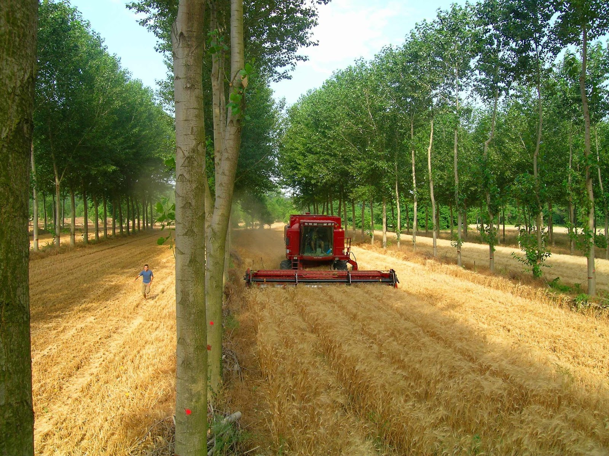
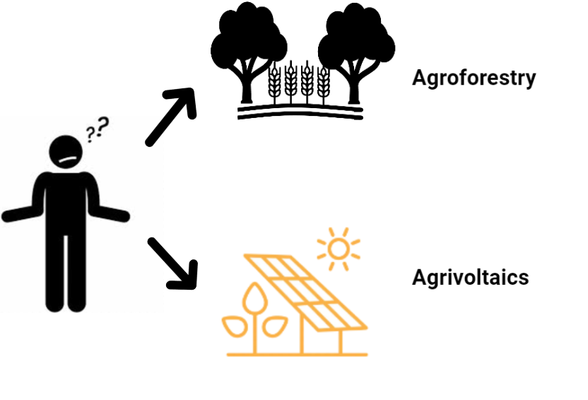
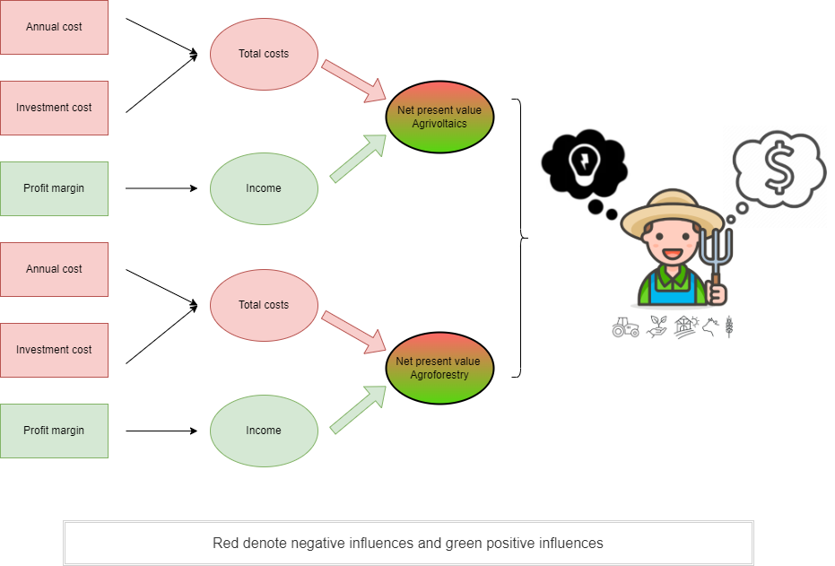
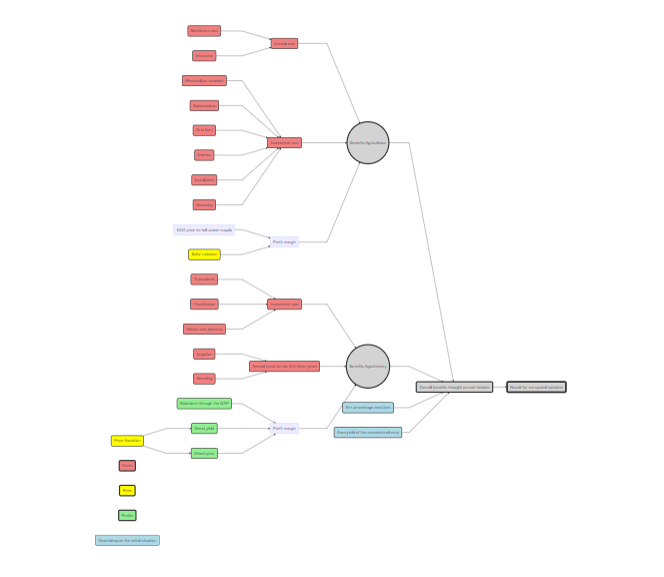

  
  ---
  
  <style>
  body {
    text-align: justify}
</style>
  
  
  
  ```{r setup, include=FALSE}
knitr::opts_chunk$set(echo = TRUE)
```

**Decision Analysis and Forecasting for Agricultural Development**

*Group Project by Julia, Jonas, Nick, Robin, Simon*


# Introduction 
In 2022, 20.4 % of german final energy consumption was covered by renewable energy. Considering the production of electricity from renewables the renewable heat sector and the production of biogenic fuels, biomass is the most important source of renewable energy, covering 52 % of final energy. Solar energy provides 14% of total renewable energy for the aforementioned sectors, focusing on electricity and heat.  The production of solar energy has increased by 57 % over a five year period (2017 – 2022), while the production of energy through biomass stayed rather constant, increasing only about 1 %. The relative importance of biomass as a source of renewable energy on the other hand increased. The reason being the decrease in energy production using nuclear power plants and fossil fuels,  which makes the “on demand” energy production, that biomass ensures all the more important in case neither wind turbines nor photovoltaics deliver enough energy to meet demands (LEWICKI, 2013). On EU-level, biomass continues to be the main source of renewable energy (about 60% of total renewable energy). Although most biomass for energy is produced within the EU, 4 % are currently being imported (EUROPEAN COMMISSION. JOINT RESEARCH CENTRE., 2019). Biomass as well as photovoltaics will likely continue to play a major role in germany’s shift to a carbon neutral energy production. 
One way to expand the production of renewable energy without the destruction of (semi-) natural ecosystems such as forests, peat bogs and high diversity pastures would be to include the production of energy into an intensive arable farming operation. Systems combining arable farming and the production of solar energy are called Agrophotovoltaic systems (Agri-PV)(Weselk et al., 2019), while the production of wood as a renewable energy source within an arable field is of many approaches, which fall under the ubrella term “Agroforestry” (ICRAF, 2017).
While both methods aim to maximize land use efficiency and promote sustainability, they have distinct characteristics and offer different benefits, which will be discussed in the following study.


**System specificities – Agriphotovoltaics (Agri-PV):**

Agri-PV can certainly become an important building block for the energy transition in the future.
Many farmers see Agri-PV as a good way to combine renewable energies with agriculture," says Udo Hemmerling, Deputy Secretary General of DBV (Deutsche Bauernverband) (DBV, 2022). Here are some arguments in favor. Photovoltaic covered 11 % of gross electricity consumption in Germany (Frauenhofer ISE, 2023). Prices for PV power plants fell by over 75 % since 2006 thanks to technological progress, economies of scale and learning effects. New plants generate PV electricity at a cost of 3.1 - 5.7 ct/kWh (Frauenhofer ISE, 2023).
Agriphotovoltaic refers to a technology for the simultaneous use of land for agriculture and electricity generation with PV (Weselk et al., 2019).
Thus, an area can be used simultaneously for both agricultural crop production (photosynthesis) and solar power generation.
In some cases, animal shelters with PV modules are also counted as Agri-PV, but there they lack differentiating features from the ordinary PV roof.
The combined use of agricultural land for food production and PV power generation offers the opportunity to address many of these challenges simultaneously.
Agri-PV provides opportunities for farms to diversify their income and close internal-farm rotation.
In particular, reduced evaporation rates and protection from hail and frost are important factors.
By utilizing existing scaffolding structures, additional protection systems can also be integrated in a cost-effective manner, , which plays an especially important role in the production of high value horicultural crops like fruits.
This can significantly increase the productivity and value of agricultural land in warm and dry years (Trommsdorff et al., 2021).
However, there are challenges to agricultural production when using Agri-PV.
These include, above all, the changing light conditions and the more difficult cultivation due to the elevation.
To minimize risks and make the best use of synergy effects, suitable crops should therefore be combined with the appropriate system design.The above arguments are quite difficult to title with values, as they can be both advantages and disadvantages. A really positive argument for this system is the decentralized approach of Agri-PV, it offers the chance to involve municipal actors and regional citizen cooperatives as well as citizens and to increase the regional value creation. 
Compared to ground-mounted systems, a greater diversity of systems can be observed in Agri-PV systems, which can be divided into open and closed systems. Closed systems essentially include PV greenhouses. Open systems can be subdivided into ground-mounted and high-mounted systems.
Therefore, we decided for this study to use the category II (ground-mounted \< 2.1 m) with the utilization form 2B (annual and perennial crops) of DIN SPEC 91434. The advantages of ground-based systems are primarily their lower cost and low impact on the landscape. Agri-PV systems should generally be permitted on all arable land. This enables both agricultural and energy use of one and the same area. Support with GAP funds continues to be possible, provided that agricultural use is only impaired by up to 15 % due to electricity generation.This is due to the fact that cultivation takes place between the Agri-PV crop rows, similar to agroforestry.
Self-supply with electricity will become much more attractive.
This is because there will no longer be any levies on own consumption and direct supply downstream of the grid interconnection point.
The levy under the Combined Heat and Power Act (Kraft-Wärme-Kopplungsgesetz) and the offshore grid levy are only charged for electricity drawn from the public grid (§ 12 Abs. 1 EnFG).
Therefore, we decided to assume the installation of a a 1000 kWp (1MWP) per hektar system within the following model.
For simplification, we decided to work on the principle of complete feed-in of the generated electricity.
In real life, the profit would consist of the saved electricity costs per month (individual own consumption in kwh x electricity price (0.42 €)) and the monthly income from the sale of electricity.


**System specificities – Agroforestry system (AFS):**

Agroforestry describes the purposeful integration of trees and shrubs (woody perennials) within a farming operation. Agroforestry for energy production combines two distinct production system within the same farm-scape, namely arable crop production (or pasture based livestock keeping) with a short rotation coppice plantation (SRCP). SRCP consist of fast growing pioneer trees, in germany mainly willows (Salix spp.), poplars (Populus spp.) or black locust (Robinia pseudoacacia). These trees are planted, mainly as cuttings, at high densities of 10.000 - 15.000 trees per hectare, and regularly cut back (coppiced). After harvesting the wood the tree stumps are left to resprout and a new production cycle of 3-7 years begins. Wood from SRCP is usually regarded as low quality and is mainly used for energy production in biomass power plants or in private households as wood chips or pellets (STROHM ET AL., 2012). For this study, we assume one option for the farmer is an AFS that consists of arable cropping with alleys of biomass producing trees.
Integrating the idea of SRCP into an alley cropping agroforestry system, rather than planting a true monoculture of fast growing trees on a decicated part of the farm provides the multiple benefits, commonly associated with AFS; The integration of woody perennials into arable cropping systems can reduce the negative ecological impacts of arable farming such as heavy soil erosion and landscape homogenisation, which is associated with a decrease in structural and biological diversity (RUNDLÖF & SMITH, 2006; JOSE, 2009). The absence of soil tillage within the tree rows and the build up of below ground biomass also leads, on farm scale, to a medium to long term increase in stored carbon (JOSE, 2009). The ecosystem services provided by agrophotovoltaincs partially overlap with the services provided by the AFS, since the soil below the solar panels is usually not tilled, leading to permanent ground cover and with that a reduction of soil erosion. Often times a mixture of native grasses and forbes is seeded below the panels, also increasing the ecological value of the overall system (WALSTON ET AL., 2022). Agri-PV always includes a necessary partial sealing of the soil to securely mount the solar panels and, due to the absence of deep rooting woody plants there is presumably less below ground carbon storage compared to AFS. 
While diversification of income streams is an effective risk management strategy in farming, the establishment of an AFS or an APVS seems desirable only if the system is at least as economically viable as the standard arable systems. That is why this study focuses on a comparison of the generated net present value (NPV) in each system, to identify which integrative approach of on-farm energy production is the most compatible. 



# Decision
In terms of energy production, should a commercial conventional arable farmer in North Rhine-Westphalia, Germany, rather establish an agroforestry system or an agriphotovoltaic system on his land?



Based on these guiding questions, two scenarios can be derived which we referred to in our
decision-support. For this study we chose to compare the Agri-PV system to an agroforestry system, consisting of arable crop land and tree strips of fast-growing poplar trees. 

This type of AFS falls within the broad definition of silvoarable AFS or "alley cropping systems". The tree strips consist of multiple rows of trees, that are densely planted (10.000 – 15.000 trees/ha) forming a dense hedgerow-like structure, that is regularly coppiced. The width of the tree strips can range from 3-25m and can legally occupy 2-35% of the arable field to be registered as an agroforestry system and be eligible to funding (Böhm, 2022)(see figure 2).

In ground-mounted Agri-PV systems, typically only the areas between the PV modules are farmed (see figure 1). The advantages of ground-mounted systems are primarily their lower cost and low impact on the landscape. Vertically arranged modules in ground-mounted systems typically have maximum electricity production in the morning and evening hours.


# Decision Maker

The head of an arable farming operation notice the current tense situation on the energy market and realise that they no longer only are responsible for food production, but also have the opportunity to contribute to the local energy security by supplying renewable energy with the land they farm. They are already familiar with the concepts of agroforestry and agrophotovoltaics, and are convinced of the ecological benefits of dividing large fields to create ecotones and structural elements to promote local biodiversity (see e.g.: JOSE, 2009). However, they will only consider setting up a new system if they can continue to farm at least as profitably as before. They wonder, which system would generate the highest net present value and how the two energy production systems compare to their standard arable operation.

# Stakeholder

Changing farming operations means making changes to the biophysical functionality of the landscape, resulting also in a change in the way the landscape looks and how the farming system, embedded within the landscape interacts with its other components. These changes are not only of the farmers concern. That is why there are usually a lot of stakeholders to consider, when planning agricultural interventions. However, the farmer is the stakeholder, who is most affected by the decision in his every day life. Other stakeholders would be businesses, directly profitting from a certain way of farming in the region. This includes for example agricultural contractors, who do the harvesting and chipping of the wood produced in the agroforestry systems. More such systems could lead to a better machine utilisation and more profit. The same applies for contractors who do maintenance work on photovoltaic systems. In case of the agroforestry system, nearby biomass power plants can be considered stakeholders as well, which might profit from the local production of the needed raw material. Nature conservation agencies might appreciate the partial extensification of the farming operation by installing solar panels of planting rows of trees but might also consider threatened open landscape species such as certain birds who might be disturbed by the addition of structural diversity within the landscape. Possible strategies of the local government to reduce the local dependence on fossil fuels or on energy-imports can result in financial aid and are therefore of interest. Lastly the acceptance of the local community regarding intense changes within the landscape must be considered when deciding on which intervention to carry out.

# Conceptual Model

The conceptual model of the decision consists of two main parts (see figure 4).
The first part includes the direct investment costs, the running costs and the profit of both decision options (see figure 5).



The actual conceptual model is illustrated in figure 5.
The cost of an agroforestry system is composed of the investment cost, the running cost, and the profit margin. Investment costs include mainly those for consultation as well as planning of the system, costs for wages and the transplants. Running costs are the recurring cost items of maintaining the agroforestry system. These are costs mainly in the first three years. This includes watering the cuttings and good weed management. In addition, we have included the risk of price fluctuation, which can occur either in the timber yield or in the timber price. In both cases, mainly the profit margin would be reduced. The only constant regarding the calculation of the profit margin is assumed to be the support from the GAP (Common Agricultural Policy). The other component of the model consists of the Agri-PV plant. So, similar to agroforestry, it is about the cost and the profit in terms of energy production. The profit is mainly derived from the Renewable Energy Sources Act (EEG) price and the amount of solar irradiation, which is influenced by the location. For the costs, a distinction was made between investment and running costs. Investment costs include photovoltaic modules, substructure, grid feed, inverter, price of installation and mounting. The running costs include the deposit insurance to operate an Agri-PV system and the maintenance costs.

These costs were expressed on a per hectare basis so that they could be scaled between the two main parts of the decision.



# Code

This chapter describes the methods and procedures used to analyze the decision process.
The procedure or working method used here is represented chronologically by the subdivision into different subsections.
All presented calculation and analysis procedures were carried out using the statistical software "R version 4.2.1" (R Development Core Team 2022) with the help of the "decisionSupport" package (Lüdeling et al.,2021).
The "decisionSupport" package supports the quantitative analysis of welfare based decision making processes using Monte Carlo simulations, which predicts possible outcomes of an uncertain event (Lüdeling et al., 2021).

> **Sowas wie: In order to be able to answer the options formulated at the beginning, the aim was to conduct a vv() function. For this purpose, the..**

You are welcome to view the full code at the [following link](https://github.com/SimonSwatek/agripv-vs-agroforestry.git). 

# Input table

For the descriptive description of the input table used, which precedes each analysis, various descriptive methods were used.
The key figures lower estimate marks and maximum were calculated using the R function "confidence interval( )".The variable values are given as the lower and upper ranges covering the 90 % confidence interval of the distribution of the variables.
Thus, the lower estimate marks the 5 % quantile and the 95 % quantile limit.
The input values were determined with the help of scientific applications and expert interviews.

Some problems became apparent when generating data for the Agri-PV system.
The system used here is still new and only at the research stage.
Therefore, investment costs are not yet considered so these costs were obtained from open space PV (top agrar, 2021). An advisor from the agricultural extension agency of North Rhine-Westphalia (Landwirtschaftskammer - LWK) informed us about the running costs with regard to the Agri-PV systems. For the EEG price we have §48 (2) EEG 2023 up to and including 1,000 kWp with fixed feed-in tariff of 5.8 ct/kwh (Bayerische Landesanstalt für Landwirtschaft, 2023).

The input estimates for the agroforestry system were derived from systems, which each represent one component of the alley cropping system assumed within this study. As the perennial component of the system can be regarded as strips of short rotation coppice plantations, estimates about inputs, costs and yields were derived from research about such plantations. The estimates for the arable component were derived mainly from yield evaluations from the LWK (see: Böcker, 2022) and similar studies (e.g.: Langenberg et al., 2018).

# Outcome
In the following chapter, we present the results we generated by using the models and methods
described above. We describe the results of the respective annual contribution margin and the
cumulative contribution margin over the 26 years for the two scenarios separately for the energy production on the farm by Agri-PV and Agroforestry.

# Discussion
In the project work presented in this manuscript, we used decision analytic approaches to
model the contribution margins of two potential energy production systems - Agri-PV and Agroforestry - 
over a time horizon of 26 years, thus providing a decision support tool for farms.


  >When comparing the two approaches for energy production on the farm, several factors come into play. Agriphotovoltaic systems excel in generating renewable energy and can provide a stable additional income stream for farmers. They require less time to establish compared to agroforestry systems and have a relatively low maintenance requirement. However, APV systems may have higher upfront costs associated with solar panel installation and require careful planning to optimize the arrangement of panels and crops.
Agroforestry, on the other hand, offers a range of ecological benefits beyond energy production. The integration of trees improves soil health, reduces erosion, and enhances carbon sequestration. agroforestry systems contribute to biodiversity conservation by providing habitat for wildlife and supporting pollinators. They can also help mitigate the impacts of climate change by providing shade and wind protection to crops and livestock.
While both agriphotovoltaic and agroforestry have their distinct advantages, they are not mutually exclusive options. In fact, a synergistic approach that combines elements of both systems could be a viable solution. Integrating solar panels within agroforestry systems, for example, allows for simultaneous energy production, biodiversity enhancement, and improved microclimates for agricultural activities. *1
Ultimately, the choice between agriphotovoltaic and agroforestry for energy production on the farm depends on various factors such as the farm's specific needs, available resources, and long-term goals. Both approaches offer opportunities to enhance sustainability, increase resilience, and contribute to a more integrated and efficient use of land for energy and agricultural production.


SIMON: Additional aspects for discussion:
- Liefecycle assesment! 
*1 Using solar energy and biomass for electricity and heat production will be essential for a more sustainable society and economy. Their true effect on the earths climate however, depends on a multitude of factors, that have to be considered, when deciding which system is the overall more sustainable. This requires a full lifecycle assessment of both energy production systems. The agroforestry system as the "low-tech" option, might at first glance seem like a carbon- and climate neutral "nature based solution", while the "high-tech" option, namely agriphotovoltaics, are more obviously linked to the extraction and consumption of non-renewable resources (i.e. for the production of solar panels). But also the production of biomass-tree cuttings requires considerable amounts of energy, since the production facilities use high amounts of nitrogen fertilizers and sythetic pesticides. The harvest, drying, storage and transportation of the wood chips are also energy intensive. Hence the importance of a thorough calculation of all energy inputs in both systems over their complete lifecycle, including the recultivation of the arable field, once the farmer decides to remove the energy production component, and the recycling of the solar panels. 

# Outlook
As mentioned above, in both systems we consider a complete hectare of the systems.
This is because each system has a range of possible acreage that must be specified by the farmer.
This is no longer a consideration of a fictitious farmer, as we assumed in our project, but an exact situation.
Since the variation widths in both systems do not have to be identical, but only can be, we decided for this procedure.

To maximize both agricultural yields and electricity production, appropriate crops must be selected in addition to the right system design.
For example, in specialty crops such as berry bushes or fruit trees, which are normally grown under hail protection nets, solar modules placed above the crops can take over this protective function, leading to synergistic effects.
However, the impact of shading on long-term yields and qualities is still unclear.

In order to achieve an optimal economic and ecological design and combination of plant systems and management of agricultural land, further data collection in different systems and the knowledge gained from this are necessary.
Within the framework of our project, the operation of two systems - Agri-PV and agroforestry - is scientifically examined.
The focus here is only on the economic consideration of the effects on agricultural management and energy production.
The system could be considered in terms of microclimate changes on the regular crop, public acceptance and the increasingly frequent Weather-related extreme events.
Due to complexity reasons this has not been considered yet.


# References
Bayerische Landesanstalt für Landwirtschaft (2023). Aktuelle Fördersätze für Photovoltaik-Anlagen ab 1. Januar 2023. LfL. https://www.lfl.bayern.de/iba/energie/161645/index.php

Böcker, T. (2022). Auswertung der Schlagkarteien für Getreide, Winterraps & Leguminosen - Ernte 2022 - Zusammengefasste Ergebnisse. Landwirtschaftskammer NRW.

Böhm, C. (2022). Themenblatt Nr. 3: Agroforstsysteme in der GAP ab 2023 – ein Überblick. https://agroforst-info.de/wp-content/uploads/2022/11/Themenblatt3-Agroforstsysteme-in-der-GAP-ab-2023.pdf

Deutscher Bauernverband (2022). Agri-Photovoltaik: bessere Chancen für kleinere Anlagen.(extension://efaidnbmnnnibpcajpcglclefindmkaj/https://www.bauernverband.de/fileadmin/user_upload/dbv/pressemitteilungen/2022/KW_21_bis_KW_40/KW_41/2022_-_130_PM_Agri-Photovoltaik_Korrektur.pdf)

European Commission. Joint Research Centre. (2019). Brief on biomass for energy in the European Union. Publications Office. https://data.europa.eu/doi/10.2760/546943

Fraunhofer-Institut für Solare Energiesysteme ISE (2023).
Aktuelle Fakten zur Photovoltaik in Deutschland, PSE PSE Projects GmbH. https://www.ise.fraunhofer.de/de/veroeffentlichungen/studien/aktuelle-fakten-zur-photovoltaik-in-deutschland.html

ICRAF. (2017). World Agroforestry | Transforming Lives and Landscapes with Trees. https://www.worldagroforestry.org/sites/default/files/users/admin/Strategy%20Report_2017.pdf

Jose, S. (2009). Agroforestry for ecosystem services and environmental benefits: an overview. Agroforestry Systems, 76(1), 1–10. https://doi.org/10.1007/s10457-009-9229-7

Langenberg, J., Feldmann, M., Theuvsen, L., Langenberg, J., Feldmann, M., & Theuvsen, L. (2018). Agroforstsysteme im Alley-Cropping-Anbauverfahren: Eine Risikoanalyse im Vergleich zum klassischen Ackerbau anhand der Monte-Carlo-Simulation. https://doi.org/10.22004/AG.ECON.309977

Lewicki, P. (2013, Juni 10). Erneuerbare Energien in Zahlen [Text]. Umweltbundesamt; Umweltbundesamt. https://www.umweltbundesamt.de/themen/klima-energie/erneuerbare-energien/erneuerbare-energien-in-zahlen

Luedeling, E., Goehring, L., Schiffers, K., Whitney, C. and E. Fernandez (2021). decisionSupport: Quantitative Support of Decision Making Under Uncertainty. https://cran.r-project.org/web/packages/decisionSupport/index.html

Rundlöf, M., & Smith, H. G. (2006). The effect of organic farming on butterfly diversity depends on landscape context: Organic farming, landscape and butterflies. Journal of Applied Ecology, 43(6), 1121–1127. https://doi.org/10.1111/j.1365-2664.2006.01233.x

Strohm, K., Schweinle, Jörg, Liesebach, Mirko, Osterburg, Bernhard, Rödl, Anne, Baum, Sarah, Nieberg, Hiltrud, Bolte, Andreas, & Walter, Katja. (2012). Kurzumtriebsplantagen aus ökologischer und ökonomischer Sicht. Arbeitsberichte aus der vTI-Agrarökonomie, 89.

Top agrar (2022).Freiflächen-Photovoltaik: Geldsegen mit TückenLandwirtschaftsverlag.
extension://efaidnbmnnnibpcajpcglclefindmkaj/https://www.wetreu.de/fileadmin/user_upload/publikationen/top_agrar_062021_Erbschaftssteuer_Photovoltaik.pdf

Trommsdorff, M., Berwind, M., Schwenke, J., Kammann, C., Stoll, M., Kärtner, T., Hannus, V., Müller, K., Schurr, U., Meier, M., Pataczek, L., Schweiger, A., Wydra, K., Heintze, G., Straubing, F., Eisel, D., Straubing, F., Feistel, U., Wild, K., … Weihenstephan-Triesdorf, H. (2021). Begleitforschung im Forschungsnetzwerk Erneuerbare Energien - Photovoltaik: Themensteckbrief der Arbeitsgruppe Agri-Photovoltaik.

Walston, L. J., Barley, T., Bhandari, I., Campbell, B., McCall, J., Hartmann, H. M., & Dolezal, A. G. (2022). Opportunities for agrivoltaic systems to achieve synergistic food-energy-environmental needs and address sustainability goals. Frontiers in Sustainable Food Systems, 6, 932018. https://doi.org/10.3389/fsufs.2022.932018

Weselek, A., Ehmann, A., Zikeli, S., Lewandowski, I., Schindele, S.
and P.Högy (2019). Agrophotovoltaic systems: applications, challenges, and opportunities. A review. Agronomy for Sustainable Development 39(4), S. 35

Whitney, C., Shepherd, K., & Luedeling, E. (2018). Decision analysis methods guide; Agricultural policy for nutrition. World Agroforestry Centre. https://doi.org/10.5716/WP18001.PDF
